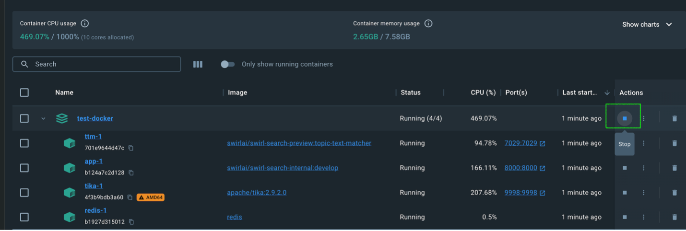

<details markdown="block">
  <summary>
    Table of Contents
  </summary>
  {: .text-delta }
- TOC
{:toc}
</details>

# Quick Start Guide - Community Edition

{: .warning }
This version applies to the Community Edition of SWIRL!

* To run SWIRL in Docker, you must have the latest [Docker app](https://docs.docker.com/get-docker/) for MacOS, Linux, or Windows installed and running locally.

* Windows users must first install and configure either the WSL 2 or the Hyper-V backend, as outlined in the  [System Requirements for installing Docker Desktop on Windows](https://docs.docker.com/desktop/install/windows-install/#system-requirements).

{: .warning }
Make sure the Docker app is running before proceeding!

* Download [https://raw.githubusercontent.com/swirlai/swirl-search/main/docker-compose.yaml](https://raw.githubusercontent.com/swirlai/swirl-search/main/docker-compose.yaml)

``` shell
curl https://raw.githubusercontent.com/swirlai/swirl-search/main/docker-compose.yaml -o docker-compose.yaml
```

* *IMPORTANT*: To use SWIRL's Real-Time Retrieval Augmented Generation (RAG) in Docker, run the following commands from the Console using a valid OpenAI API key:
``` shell
export MSAL_CB_PORT=8000
export MSAL_HOST=localhost
export OPENAI_API_KEY='<your-OpenAI-API-key>'
```

{: .highlight }
Check out [OpenAI's YouTube video](https://youtu.be/nafDyRsVnXU?si=YpvyaRvhX65vtBrb) if you don't have an OpenAI API Key.

* On MacOS or Linux, run the following command from the Console:

``` shell
docker-compose pull && docker-compose up
```

* On Windows, run the following command from PowerShell:

``` shell
docker compose up
```

After a few minutes, the following or similar should appear:

``` shell
redis-1  | 1:C 05 Feb 2024 22:03:51.503 * oO0OoO0OoO0Oo Redis is starting oO0OoO0OoO0Oo
redis-1  | 1:C 05 Feb 2024 22:03:51.503 * Redis version=7.2.4, bits=64, commit=00000000, modified=0, pid=1, just started
redis-1  | 1:C 05 Feb 2024 22:03:51.503 # Warning: no config file specified, using the default config. In order to specify a config file use redis-server /path/to/redis.conf
redis-1  | 1:M 05 Feb 2024 22:03:51.504 * monotonic clock: POSIX clock_gettime
redis-1  | 1:M 05 Feb 2024 22:03:51.504 * Running mode=standalone, port=6379.
redis-1  | 1:M 05 Feb 2024 22:03:51.505 * Server initialized
redis-1  | 1:M 05 Feb 2024 22:03:51.505 * Ready to accept connections tcp
app-1    | __S_W_I_R_L__3_._2_._0__________________________________________________________
app-1    | 
app-1    | Setting Up Swirl:
app-1    | Checking Migrations:
app-1    | 
app-1    | Migrating:
app-1    | 
app-1    | Operations to perform:
app-1    |   Apply all migrations: admin, auth, authtoken, contenttypes, django_celery_beat, sessions, swirl
app-1    | Running migrations:
app-1    |   No migrations to apply.
app-1    | 
app-1    | 
app-1    | Collecting Statics:
app-1    | 
app-1    | 
app-1    | 246 static files copied to '/app/static'.
app-1    | 
app-1    | Ok
app-1    | Command successful!
app-1    | __S_W_I_R_L__3_._2_._0__________________________________________________________
app-1    | 
app-1    | Warning: logs directory does not exist, creating it
app-1    | ParseResult(scheme='redis', netloc='redis:6379', path='/0', params='', query='', fragment='') checked.
app-1    | ParseResult(scheme='redis', netloc='redis:6379', path='/0', params='', query='', fragment='') checked.
app-1    | Start: celery-worker -> celery -A swirl_server worker --loglevel INFO ... Ok, pid: 50
app-1    | Start: celery-beats -> celery -A swirl_server beat --scheduler django_celery_beat.schedulers:DatabaseScheduler ... Ok, pid: 72
app-1    | Updating .swirl... Ok
app-1    | 
app-1    |   PID TTY          TIME CMD
app-1    |    50 ?        00:00:03 celery
app-1    | 
app-1    | You're using version 3.2.0 of Swirl, the current version.
app-1    | Command successful!
app-1    | 2024-02-05 17:04:14,131 INFO     Starting server at tcp:port=8000:interface=0.0.0.0
app-1    | 2024-02-05 17:04:14,131 INFO     HTTP/2 support not enabled (install the http2 and tls Twisted extras)
app-1    | 2024-02-05 17:04:14,131 INFO     Configuring endpoint tcp:port=8000:interface=0.0.0.0
app-1    | 2024-02-05 17:04:14,132 INFO     Listening on TCP address 0.0.0.0:8000
```

* Open this URL with a browser: <http://localhost:8000> (or <http://localhost:8000/galaxy>)

If the search page appears, click `Log Out` at the top, right. The SWIRL login page will appear:


* Enter the username `admin` and password `password`, then click `Login`.

* Enter a search in the search box and press the `Search` button. Ranked results appear in just a few seconds:


* Click the `Generate AI Insight` button to RAG using the most relevant results. 

{: .warning }
As noted above, you must have setup OpenAI or Azure/OpenAI prior to executing this step.


* Click the profile avatar in the upper right corner of the Galaxy UI. Then click [Manage SWIRL](http://localhost:8000/swirl/) to explore the rest of SWIRL's features.

* To view the raw result JSON, click `Search` under the API section of the `Manage SWIRL` page linked above, or open <http://localhost:8000/swirl/search/>

The most recent Search object will be displayed at the top. Click on the `result_url` link to view the full JSON Response. For example:


* Read the [SWIRL User Guide](./User-Guide.md) for additional information.

* To shut down SWIRL:

1.	Via Docker Desktop: 


2.	Press CTRL-C in the terminal window where Docker Compose is running:


3. Execute docker-compose stop from a different terminal:


{: .warning }
The Docker version of SWIRL AI Connect Community Edition does *not* retain any data or configuration when shut down. 

## Notes

{: .highlight }
SWIRL includes SearchProviders for Google Web (via their Programmable Search Engine offering), Arxiv.org, European PMC, Google News and SWIRL Documentation to get you up and running right away. The credentials for the Google Cloud API are shared with the SWIRL Community for this purpose.

{: .highlight }
Using SWIRL with Microsoft 365 requires installation and approval by an authorized company Administrator. For more information, please review the [M365 Guide](M365-Guide.md) or contact support as noted below. 